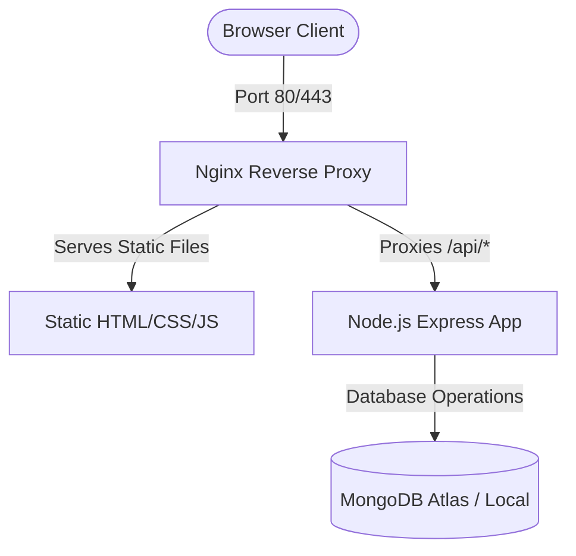

# Vazraa Mobility Platform

Vazraa Mobility is a unified cab booking platform consisting of:
1. **Frontend**: Pure HTML, CSS (Vanilla), and JavaScript.
2. **Backend API**: Node.js, Express, and MongoDB.
3. **Infrastructure**: Multi-stage Docker configurations orchestrated via Docker Compose and served behind an Nginx reverse proxy.

---

## Architecture Overview



---

## Production Deployment (Docker Compose)

The application is fully containerized and production-ready. Frontend static assets are served efficiently via Nginx, which also handles reverse proxying to the backend Node.js API, resolving CORS errors automatically by exposing a unified origin.

### Prerequisites
- [Docker](https://www.docker.com/) (version 20.10.0 or later)
- [Docker Compose](https://docs.docker.com/compose/) (version 1.29.0 or later)
- An active MongoDB connection string (e.g., MongoDB Atlas)

### Steps to Run

1. **Clone the repository**:
   ```bash
   git clone https://github.com/apeksha0463/vazraa-website.git
   cd vazraa-website
   ```

2. **Configure Environment Variables**:
   Copy `.env.example` to create `.env`:
   ```bash
   cp .env.example .env
   ```
   Open `.env` in a text editor and fill in your production values (especially `MONGODB_URI` and `JWT_SECRET`).

3. **Build the Docker Images**:
   ```bash
   docker compose build
   ```

4. **Launch the Application**:
   ```bash
   docker compose up -d
   ```

5. **Verify Status**:
   ```bash
   docker compose ps
   ```

The application will be accessible at `http://localhost` (or the configured `FRONTEND_PORT`).

---

## Codebase Structure

```
├── Dockerfile.frontend     # Frontend Nginx container setup
├── nginx.conf              # Nginx reverse proxy & compression setup
├── docker-compose.yml      # Multi-service production orchestration
├── .dockerignore           # Main docker ignore list
├── .gitignore              # Main repository ignore list
├── .env.example            # Production environment variables example
├── README.md               # Main repository documentation
├── files/                  # Frontend static code (HTML, CSS, JS)
│   ├── api.config.js       # Dynamic base API selector
│   └── index.html          # Main landing page
└── backend/                # Backend API code
    ├── Dockerfile          # Backend Node.js alpine container setup
    ├── package.json        # Dependencies (helmet, compression, rate-limiting)
    └── src/
        ├── app.js          # Express app definition & security middlewares
        └── server.js       # App entry point with graceful shutdown handler
```

---

## Features & Security

- **Reverse Proxy Setup**: Serves static HTML and routes API queries on the same port/origin, completely eliminating CORS errors.
- **Signal Handlers (`SIGINT`/`SIGTERM`)**: Consolidates graceful shutdown patterns on the server, finishing pending operations before exiting.
- **Database Safety Checks**: Upgraded `/health` endpoint checks database connectivity status to report reliable health reports back to Docker.
- **Request Rate Limiting**: Global limiters (100 reqs/15 mins) and strict auth limiters (20 reqs/15 mins) protect backend endpoints.
- **Asset Compression**: Injected gzip algorithms at the Nginx and Express level.
- **Secure Error Handling**: Stack traces are hidden from API users when `NODE_ENV=production`.
- **Environment Validation**: Critical keys are validated at server startup to prevent running on misconfigured deployments.

---

## License
Licensed under the ISC License.
